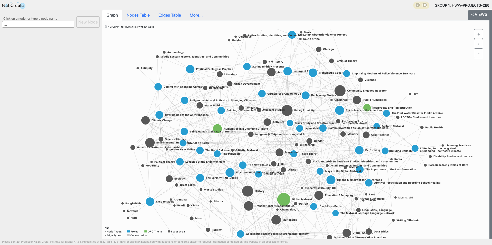

types of projects, types of outcomes, etc 

## Grand Research Challenge

In its third iteration, the Grand Research Challenge provided grants of up to $150,000 over a three year period for teams pursuing research with a commitment to methodologies of reciprocity and redistribution. GRC-funded projects answer questions such as "What does humanities collaboration look like when it is multi-sited as well as interdisciplinary: when scholars from a variety of institutions and communities come together to partner not just in discrete research projects, but in the broader context of rethinking the direction of humanities research and education as well?" And, "what can humanities research and practice do to turn our attention to the most compelling and urgent questions of our time—global displacement, police violence, water and food justice, multiracial community-building, racial disparities in health, indigenous art and activism—so that scholars move continuously across that porous boundary between the academic and the world? How, in short, can we design a humanities ecosystem that is truly 'without walls?'"

Through modes of research partnership that are reciprocal and redistributive, collaborators will demonstrate that “humanities without walls” is not only a metaphor but also a strategic commitment to imagining and doing academic work more inclusively—with universal access, social equity and racial diversity always front of mind.

Still need to figure out how to embed or link to stable viewing environment

### HWW Grand Research Challenge Network: User Guide
This network shows the Humanities Without Walls Grand Research Challenge projects, areas of focus associated with the projects, and the themes for each cycle of research funding. Humanities Without Walls, funded by a grant from the Andrew W. Mellon Foundation, has had three major themes throughout its duration from 2012-2026: the Global Midwest (2014-2016), Humanities in a Changing Climate (2017-2021), and Reciprocity and Redistribution (2022-2026). Each theme is represented by a green node and is connected to the projects (blue nodes) funded under it. The grey nodes represent the areas of focus across Grand Research Challenge projects. You’ll notice that while some focus areas are primarily connected to projects funded under one particular theme, other focus areas span across the entirety of the network. For example, majority of the projects connected to the “climate change” focus area node was funded under the Humanities in a Changing Climate theme, while focus areas such as “History” and “Race / Ethnicity” have project connections that are more equally distributed across the three themes. The primary purpose of this network is twofold—first, the network graph helps make visible connections across the GRC themes, projects, and foci; second, those connections show us patterns in the GRC that help us think about the roles, places, and impacts of humanities work in the Midwest and beyond. 

This network was built using [Net.Create](https://netcreate.org/), an open-source network analysis and data visualization tool created by researchers Drs. Kalani Craig (University of Illinois, History) and Joshua Danish (University of Illinois, Curriculum and Instruction). 

#### *How to Use this Network:*

For an overview of network and network analysis terminology, navigate to the “more” tab at the top of the graph and click on “vocabulary.”
Click on the green nodes to learn more about the GRC themes, the blue nodes to learn more about each project, and the grey nodes to see what projects focus on that topic. The lines between the nodes represent connections. The larger a node is, the more connections it has. When you click on a node, navigate to the “edges” tab to see the other nodes that one is connected to. The GRC theme nodes are only connected to the projects funded under that theme. The project nodes have connections to both the themes and focus areas (and in some cases, other projects, representing collaborations between project teams). 

You can also use the nodes and edges tables to sort the data by different attributes. For example, in the nodes table, clicking on “degrees” will sort the nodes by the number their numbers of connections, in either ascending or descending order. Or, in the edges table, clicking on “target” will sort the data so that the table reads “X” project is connected to “Y” focus area, with the connection sorted in alphabetical order. 

*Filtering:* The “views” tab at the top of the graph allows you to filter the data visible in the network so you can hone in on specific connections and patterns. For example, to see only projects and focus areas, use the Reduce filter with “does not contain” and “GRC theme” in the Type field. This allows you to see just the projects and focus areas. You can also select one node and then click on the focus filter to see only that the node and its connections. To view one theme, its projects, and the focus areas of those projects, use the focus filter, select a theme, and increase the range to 2. For more information about filtering, refer to the [Net.Create documentation](https://netcreate.org/netcreate-userdocs/docs/NetworkAnalysis/filteringData/filteringData.html). 

*Analysis:* **more to come!** the patterns we (HWW) see… betweenness centrality—climate change node indirectly connected to humanities in a changing climate node via the projects connected to climate change and changing climate…other types of centrality…biggest foci of each theme…biggest foci in general

